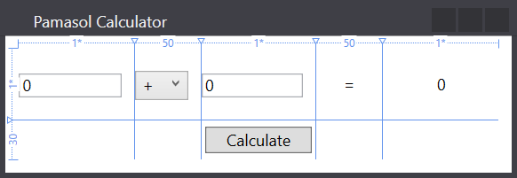

# Simple Calculator in C# .NET Windows Forms


## Setting up solution

1. Download and install Visual Studio Community Edition from [visualstudio.microsoft.com/downloads](https://visualstudio.microsoft.com/downloads/). 

2. Open Visual Studio and click **Create a new project**.

3. Choose **Windows Forms App (.NET Framework)** as shown in screenshot below and click **Next**.


4. Add **Project name** Calculator and update **Location** path accrording your needs.

5. As soon as the project has been created, check if **Toolbox** and **Solution Explorer** are visible as shown in the screenshot below in red. If not, add them via menu **View**.


## Create the grid

Let's move to the graphic designer and click on the middle of the window. This selects its inner parts which, in most cases, is the Grid. Every new window contains a Grid by default, without it, it would be very difficult to add multiple elements to a window. When we select the Grid, "rails" appear over the top and left edges. We can select a point there using the mouse and split it up into rows or columns (at the position in which you clicked). Now that that's been said, create a table of 2 rows and 5 columns. We'll add form controls to the table cells later on.


Looking at the Grid's XAML code, we see that two new elements have appeared: `RowDefinitions` and `ColumnDefinitions`. These define the number of rows and columns that are to be generated by the graphic designer. The code is chock full of absolute sizes by default, which you should now know is an inefficient thing. Edit the XAML code so looks like this:

```yaml
<Window x:Name="PamasolCalculator" x:Class="Calculator.MainWindow"
        xmlns="http://schemas.microsoft.com/winfx/2006/xaml/presentation"
        xmlns:x="http://schemas.microsoft.com/winfx/2006/xaml"
        xmlns:d="http://schemas.microsoft.com/expression/blend/2008"
        xmlns:mc="http://schemas.openxmlformats.org/markup-compatibility/2006"
        xmlns:local="clr-namespace:Calculator"
        mc:Ignorable="d"
        Title="Pamasol Calculator" Height="134" Width="388" MinWidth="388" MinHeight="134">
    <Grid Margin="10">
            <Grid.ColumnDefinitions>
                    <ColumnDefinition Width="*"/>
                    <ColumnDefinition Width="50"/>
                    <ColumnDefinition Width="*"/>
                    <ColumnDefinition Width="50"/>
                    <ColumnDefinition Width="*"/>
            </Grid.ColumnDefinitions>
            <Grid.RowDefinitions>
                    <RowDefinition Height="*"/>
                    <RowDefinition Height="30"/>
            </Grid.RowDefinitions>
    </Grid>
</Window>
```

We have set the `Margin` of the Grid to 10 DIP. What this does is keep the controls on the grid from being too close to the window edges.

In the number of columns and their widths specified in the column definition section (which is pretty self-explanatory). `Width="*"` lets resizte cells when the main window will be rezised. The cells that contain numbers do not rezise.

Row definitions are done in a similar fashion. Here, the second row is exactly 30 DIP high, and the first row is set to fill the rest of the window.

Technically, we could set everything from the Graphic designer. However, it would be a bit harder to achieve the same results and would get progressively more, and more difficult.

## Adding controls

Now that that's done, let's add several more elements in the Grid definition.

### Button

We'll start out by adding a button:

```yaml
<Button Content="Calculate" Width="80" VerticalAlignment="Center" Grid.Row="1" Grid.Column="2"/>
```

Here, we have set the button's width to 80 DIP, its vertical alignment to center, and set the text label using the Content attribute. We don't need to set the horizontal alignment once a fixed width has been specified, the button will be centered horizontally.

The attributes that matter most to us in this case, are the `Grid.Row` and the `Grid.Column` attributes. What they do is indicate precisely where we want the control to be inserted (which cell the control should be inserted into). As always, the index starts from zero (meaning that the "first row" is actually the "0th" row).

### TextBox

A TextBox is a field used for text input. Our application needs two of them, so we will need to add the following code to the grid:

```yaml
<TextBox VerticalAlignment="Center" Grid.Row="0" Grid.Column="0" Margin="0,0,10,0" Text="0" />
<TextBox VerticalAlignment="Center" Grid.Row="0" Grid.Column="2"  Margin="0,0,10,0" Text="0" />
```

Keep in mind that we inserted the TextBoxes into the first Grid row, whose height stretches along with the form. In order to keep things looking good, we'll have to center them vertically. We'll set the right margins to 10 DIP and the texts to 0 (which is the default input value of almost all calculators). Also, don't forget to enter the grid cell's coordinates correctly.

Just so you know, in order to enter multi-line text you would have to add these two attributes to the TextBox (we won't be using it on our calculator):

```yaml
TextWrapping="Wrap" AcceptsReturn="True"
```

### ComboBox

A ComboBox is a drop-down list of several items. In this application, we'll use it to choose from a set of predefined operations, i.e. +, -, *, /.

Our combobox will be defined as follows:

```yaml
<ComboBox VerticalAlignment="Center" Grid.Row="0" Grid.Column="1"  Margin="0,0,10,0" SelectedIndex="0">
        <ComboBoxItem Content="+"/>
        <ComboBoxItem Content="-"/>
        <ComboBoxItem Content="*"/>
        <ComboBoxItem Content="/"/>
</ComboBox>
```

The `SelectedIndex` is the index of all of the selected items, which in our case is the first. Individual items are nested in the `ComboBox` as `ComboBoxItem` elements. We use the content attribute to set their text label. As a matter of fact, you can insert almost anything in there, be it images, colors, or whatever it is you need.

### TextBlock

The last couple of things we are going to add to our calculator today are TextBlocks (which we are already familiar with):

```yaml
<TextBlock Grid.Row="0" Grid.Column="3" VerticalAlignment="Center" HorizontalAlignment="Center">=</TextBlock>
<TextBlock Grid.Row="0" Grid.Column="4" VerticalAlignment="Center" HorizontalAlignment="Center">0</TextBlock>
```

The first `TextBlock` is the "equals" sign between the second number and the result, the second one holds the result.

Done! Don't forget to resize it to make sure the relative positioning parts function properly! All of the controls should adapt beautifully regardless of the window size.



## Adding the logic

Up to this point we have created the visual user interface. If you would run the application now and click on the "Calculate" button nothing will happen. What's missing is the event handler for the button. 
To modify the grid elements we have to add name attributes to the grid definitions. For example the result `TextBox` can be named as `labelResult` like this:
```yaml
<TextBlock Name="labelResult"  Grid.Row="0" Grid.Column="4" VerticalAlignment="Center" HorizontalAlignment="Center">0</TextBlock>
```
In the event handler method we can now set the `labelResult.Text` property to update the final calculator result.

We need to add names to all grid fields with dynamic content. The final XAML code should look similar to this:

```yaml
<Window x:Name="PamasolCalculator" x:Class="Calculator_WPF.MainWindow"
        xmlns="http://schemas.microsoft.com/winfx/2006/xaml/presentation"
        xmlns:x="http://schemas.microsoft.com/winfx/2006/xaml"
        xmlns:d="http://schemas.microsoft.com/expression/blend/2008"
        xmlns:mc="http://schemas.openxmlformats.org/markup-compatibility/2006"
        xmlns:local="clr-namespace:Calculator_WPF"
        mc:Ignorable="d"
        Title="Pamasol Calculator" Height="134" Width="388" MinWidth="388" MinHeight="134">
    <Grid Margin="10">
        <Grid.ColumnDefinitions>
            <ColumnDefinition Width="*"/>
            <ColumnDefinition Width="50"/>
            <ColumnDefinition Width="*"/>
            <ColumnDefinition Width="50"/>
            <ColumnDefinition Width="*"/>
        </Grid.ColumnDefinitions>
        <Grid.RowDefinitions>
            <RowDefinition Height="*"/>
            <RowDefinition Height="30"/>
        </Grid.RowDefinitions>
        <Button Content="Calculate" Width="80" VerticalAlignment="Center" Grid.Row="1" Grid.Column="2" Click="Button_Click"/>
        <TextBox Name="numericUpDownInput1" VerticalAlignment="Center" Grid.Row="0" Grid.Column="0" Margin="0,0,10,0" Text="0" />
        <TextBox Name="numericUpDownInput2" VerticalAlignment="Center" Grid.Row="0" Grid.Column="2"  Margin="0,0,10,0" Text="0" />
        <ComboBox Name="comboBoxOperation" VerticalAlignment="Center" Grid.Row="0" Grid.Column="1"  Margin="0,0,10,0" SelectedIndex="0">
            <ComboBoxItem Content="+"/>
            <ComboBoxItem Content="-"/>
            <ComboBoxItem Content="*"/>
            <ComboBoxItem Content="/"/>
        </ComboBox>
        <TextBlock Grid.Row="0" Grid.Column="3" VerticalAlignment="Center" HorizontalAlignment="Center">=</TextBlock>
        <TextBlock Name="labelResult"  Grid.Row="0" Grid.Column="4" VerticalAlignment="Center" HorizontalAlignment="Center">0</TextBlock>
    </Grid>
</Window>
```

The event handling method's code may look like this:

```csharp
private void Button_Click(object sender, RoutedEventArgs e)
{
        // Variables setup
        string operation = comboBoxOperation.Text;
        double number1 = Convert.ToDouble(numericUpDownInput1.Text);
        double number2 = Convert.ToDouble(numericUpDownInput2.Text);
        double result = 0;

        // Calculation
        if (operation == "+")
        result = number1 + number2;
        else if (operation == "-")
        result = number1 - number2;
        else if (operation == "*")
        result = number1 * number2;
        else if (operation == "/")
        {
        if (number2 != 0)
                result = number1 / number2;
        else
                MessageBox.Show("You can't divide by zero");
        }
        labelResult.Text = result.ToString();
}
```

## Run the application

Run the application as shown in screenshot below by clicking **Start**.


As soon as the build is successfully completed, you will find an exe file in the `bin -> Debug` folder.