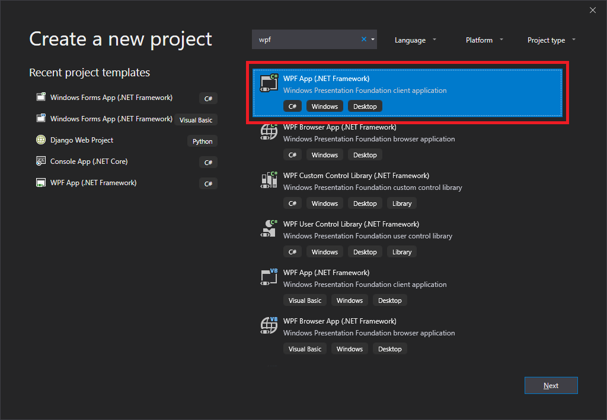
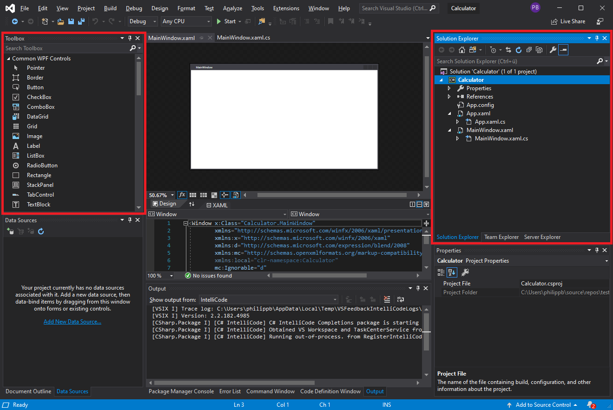
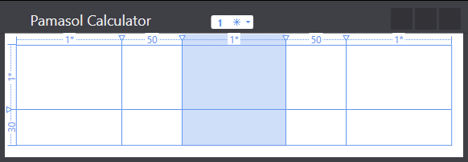
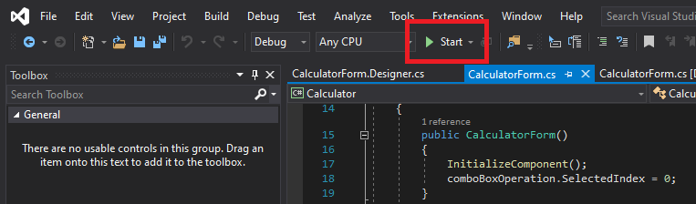

# Simple Calculator in C# .NET Windows Forms


## Setting up solution

1. Download and install Visual Studio Community Edition from [visualstudio.microsoft.com/downloads](https://visualstudio.microsoft.com/downloads/). 

2. Open Visual Studio and click **Create a new project**.

3. Choose **Windows Forms App (.NET Framework)** as shown in screenshot below and click **Next**.



4. Add **Project name** Calculator and update **Location** path accrording your needs.

5. As soon as the project has been created, check if **Toolbox** and **Solution Explorer** are visible as shown in the screenshot below in red. If not, add them via menu **View**.



6. Rename `Form1.cs` to `CalculatorForm.cs` in the **Solution Explorer** as shown in the screenshot above in green.

## Create the grid

Let's move to the graphic designer and click on the middle of the window. This selects its inner parts which, in most cases, is the Grid. Every new window contains a Grid by default, without it, it would be very difficult to add multiple elements to a window. When we select the Grid, "rails" appear over the top and left edges. We can select a point there using the mouse and split it up into rows or columns (at the position in which you clicked). Now that that's been said, create a table of 2 rows and 5 columns. We'll add form controls to the table cells later on.



Looking at the Grid's XAML code, we see that two new elements have appeared: `RowDefinitions` and `ColumnDefinitions`. These define the number of rows and columns that are to be generated by the graphic designer. The code is chock full of absolute sizes by default, which you should now know is an inefficient thing. Edit the XAML code so looks like this:

```yaml
<Window x:Name="PamasolCalculator" x:Class="Calculator.MainWindow"
        xmlns="http://schemas.microsoft.com/winfx/2006/xaml/presentation"
        xmlns:x="http://schemas.microsoft.com/winfx/2006/xaml"
        xmlns:d="http://schemas.microsoft.com/expression/blend/2008"
        xmlns:mc="http://schemas.openxmlformats.org/markup-compatibility/2006"
        xmlns:local="clr-namespace:Calculator"
        mc:Ignorable="d"
        Title="Pamasol Calculator" Height="134" Width="388" MinWidth="388" MinHeight="134">
    <Grid Margin="10">
            <Grid.ColumnDefinitions>
                    <ColumnDefinition Width="*"/>
                    <ColumnDefinition Width="50"/>
                    <ColumnDefinition Width="*"/>
                    <ColumnDefinition Width="50"/>
                    <ColumnDefinition Width="*"/>
            </Grid.ColumnDefinitions>
            <Grid.RowDefinitions>
                    <RowDefinition Height="*"/>
                    <RowDefinition Height="30"/>
            </Grid.RowDefinitions>
    </Grid>
</Window>
```

We have set the `Margin` of the Grid to 10 DIP. What this does is keep the controls on the grid from being too close to the window edges.

In the number of columns and their widths specified in the column definition section (which is pretty self-explanatory). `Width="*"` lets resizte cells when the main window will be rezised. The cells that contain numbers do not rezise.

Row definitions are done in a similar fashion. Here, the second row is exactly 30 DIP high, and the first row is set to fill the rest of the window.

Technically, we could set everything from the Graphic designer. However, it would be a bit harder to achieve the same results and would get progressively more, and more difficult.


## Run the application

Run the application as shown in screenshot below by clicking **Start**.



Ss soon as the build is successfully completed, you will find an exe file in the `bin -> Debug` folder.