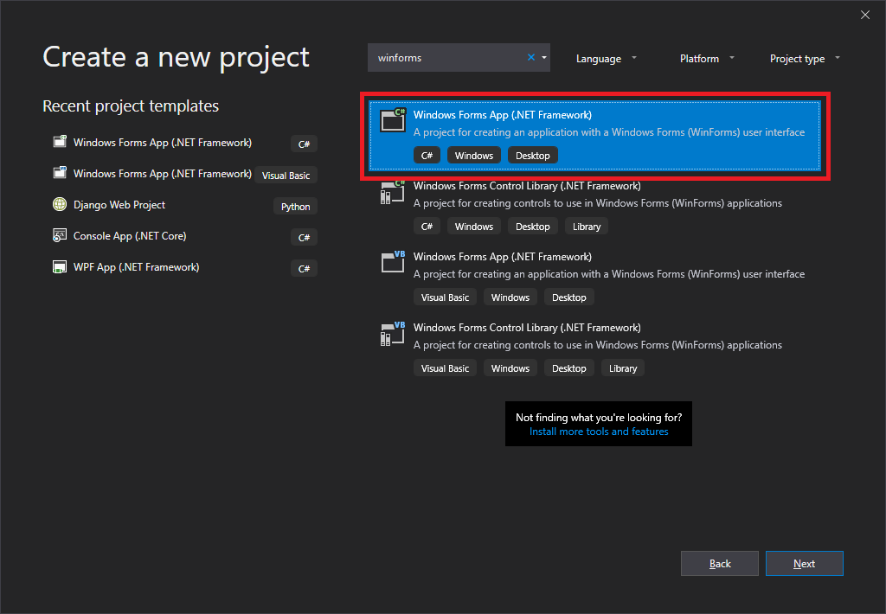
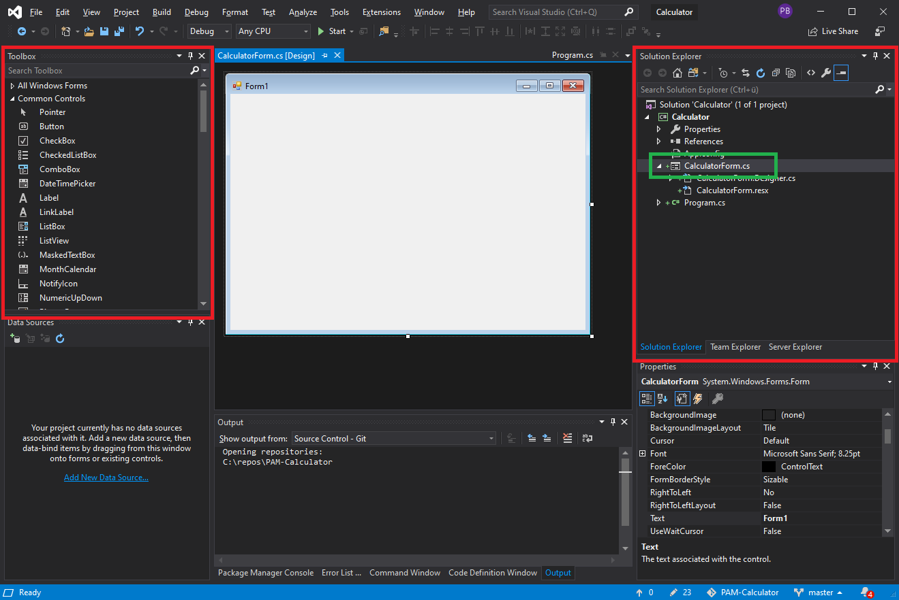
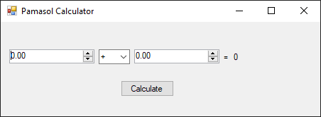
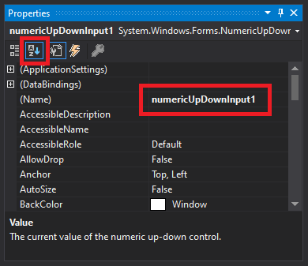
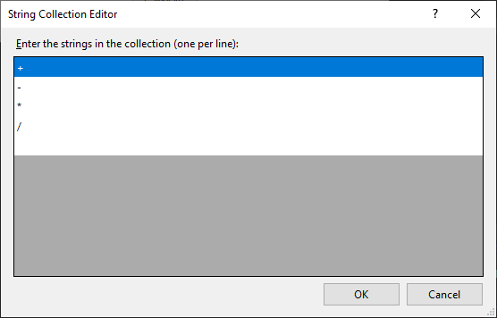
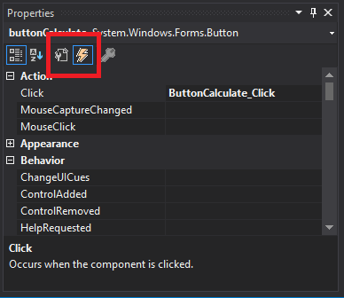
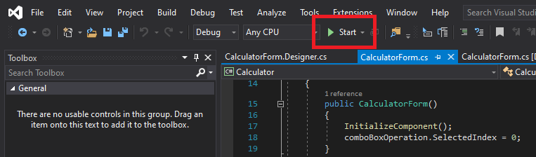

# Simple Calculator in C# .NET Windows Forms


## Setting up solution

1. Download and install Visual Studio Community Edition from [visualstudio.microsoft.com/downloads](https://visualstudio.microsoft.com/downloads/). 

2. Open Visual Studio and click **Create a new project**.

3. Choose **Windows Forms App (.NET Framework)** as shown in screenshot below and click **Next**.



4. Add **Project name** Calculator and update **Location** path accrording your needs.

5. As soon as the project has been created, check if **Toolbox** and **Solution Explorer** are visible as shown in the screenshot below in red. If not, add them via menu **View**.



6. Rename `Form1.cs` to `CalculatorForm.cs` in the **Solution Explorer** as shown in the screenshot above in green.

## Create visual part of the form

From the toolbox take 2x Label, 1x Button, 2x NumericUpDown and 1x ComboBox and place them on your form as shown in screenshot below.



Name them as follows in **Properties**:
    * `numericUpDownInput1` for input 1 that comes from the user
    * `numericUpDownInput2` for input 2 that comes from the user
    * `comboBoxOperation` for the operation dropdown
    * `buttonCalculate` for the calculation button
    * `labelEqual` for the = sign
    * `labelResult` for the area where the result will appear

We recommend switching the properties from the categorized view to alphabetical order. See screenshot below (first 2 icons in the Properties window), you'll find properties faster. Name is the name of the control, Text is what is written on the control. This logically implies that we can have multiple controls with the same text on a form, but they have to have different names.



**Label** is simply a text label. If we don't use a control in the code, we don't have to name it. If we do, we should set the `Name` property of it, then we'll be able to access this control using this name. `Name` is the name of the control, `Text` is what is written on the control. This logically implies that we can have multiple controls with the same text on a form, but they have to have different names. We name it `labelEqual` and `labelResult`.

**Button** is simply a button that calls a method (more precisely, an event) when clicked. In our case, we name this button `buttonCalculate` and we set its Text to `Calculate`. We'll assign the event to the button later.

**NumericUpDown** is a control for entering a value. By default, we can only enter an integer in it. We can change this behavior by setting the DecimalPlaces property, which specifies the number of decimal places. We'll set this value to `2` for both controls we put in our form. We also set their Minimum and Maximum properties. In our case, the minimum is `0`, the maximum `10000`. The advantage of entering numbers using this control is that the user isn't able to enter any nonsense value. We name the controls as `numericUpDownInput1` and `numericUpDownInput2`.

**ComboBox** is a drop-down list with several predefined items. Click right on the form and then **Edit items...**. Now you can put in the operation modes as shown in the screenshot below. We name it `comboBoxOperation`.



## Code the form

We will move to the source code of the form. We already know we do this by pressing **F7** or by right-clicking on the form and selecting **View Code**.

Inside the form constructor, below the InitializeComponents() method call, we'll set the selected item of the comboBoxOperation. To do this, we'll set the SelectedIndex property to 0, thus the first item:

```csharp
public CalculatorForm()
{
    InitializeComponent();
    comboBoxOperation.SelectedIndex = 0;
}
```

Of course, we can access all the form's items from the form.

Into the constructor, we write the code that should be executed right after the form is created. When you run the app, adding will be selected as the operation (index 0).

Now all we have to do is to respond to the button's click event. We'll move back from the code to the form again, then we'll double-click the button. A new method will be automatically added into the code:

```csharp
private void ButtonCalculate_Click(object sender, EventArgs e)
{

}
```

The method above will be called, when the button is clicked.

Let's go back to the designer (**Shift + F7**) to select the button. In the Properties window, we can switch between properties and events using the buttons highlighted in red below:



## Calculation

Let's move to the calculation itself. The code won't be complicated at all. We'll simply just use conditions for the operationComboBox items and calculate the result inside the event handler of the button accordingly. Then we'll set the result as the text of resultLabel. We shouldn't forget to handle division by zero.

The event handling method's code may look like this:

```csharp
private void ButtonCalculate_Click(object sender, EventArgs e)
{
    // Variables setup
    string operation = comboBoxOperation.SelectedItem.ToString();
    double number1 = Convert.ToDouble(numericUpDownInput1.Value);
    double number2 = Convert.ToDouble(numericUpDownInput2.Value);
    double result = 0;

    // Calculation
    if (operation == "+")
        result = number1 + number2;
    else if (operation == "-")
        result = number1 - number2;
    else if (operation == "*")
        result = number1 * number2;
    else if (operation == "/")
    {
        if (number2 != 0)
            result = number1 / number2;
        else
            MessageBox.Show("You can't divide by zero");
    }
    labelResult.Text = result.ToString();
}
```

First, we store the values from the controls in variables to make the code more readable. We access the selected comboBox item using the `SelectedItem` property, which is of the `object` type. This means we have to convert it to `string` in our case. Similarly, we could also use just the item index using `SelectedIndex`. Since `NumericUpDown` returns the value in its `Value` property which is of the `decimal` type, we must convert it to the `double` type using the `Convert` class.

For the case of zero divisor, we display a `MessageBox` using the static class of the same name and calling the `Show()` method. Finally, we display the result in `labelResult`. Unlike the console, where we could simply print the numbers, we must first convert the numbers to `string` here.

You can also set the Icon property of the form (by selecting the icon file)and Text to "Pamasol Calculator".

## Run the application

Run the application as shown in screenshot below by clicking **Start**.



Ss soon as the build is successfully completed, you will find an exe file in the `bin -> Debug` folder.